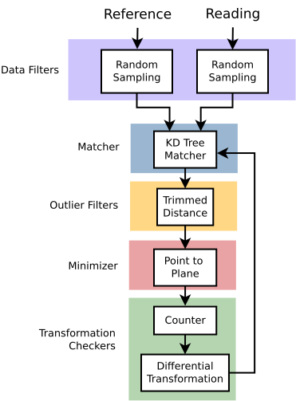

| [Tutorials Home](index.md) | [Previous](DefaultICPConfig.md) | [Next](ImportExport.md) |
| :--- | :---: | ---: |

# Creating Custom Configurations with YAML

## Overview

The implementation of the ICP algorithm in libpointmatcher is modular and can be tailored to the user's needs by writing custom configurations.  Configurations in libpointmatcher are defined in YAML files.  Very briefly, [YAML](http://www.yaml.org/) is a document format which allows data to be written in a way which is both readable by a program and by a human.  For a more detailed treatment of the language, refer to the [project's specification page](http://www.yaml.org/spec/1.2/spec.html).

## Configuration of a Chain of DataPointsFilters

The first libpointmatcher object that can be constructed by YAML files is `DataPointsFilters` which represents a chain of data filters.  The configuration is loaded by calling its constructor with a string representing the path to the configuration file as an argument.  The configuration file is structured as follows:

The configuration is represented in YAML as a list.  Each filter represents a list entry and is included by preceding its name by a dash `-`.  The parameters for each filter are stored in a dictionary with each parameter entry taking the form `<param name>: <param value>`.  When a parameter is not specified, the default values are used.

```yaml
- DataPointsFilter1:    # Uses parameters
    param1: param1Value
    param2: param2Value

- DataPointsFilter2     # Uses default values
```

Note that the order in which filters are included is important.  The first reason is that each filtering step alters the point cloud and the order in which each filtering step is done is important.  The second reason is that some filters require descriptors.  The filters generating these descriptors must thus be included further up the chain.  For more information on the different data filters available in libpointmatcher, their parameters and requirements, refer to the [data filters tutorial](DataFilters.md).

### Using a Configuration in Your Code

To load an data filters configuration from a YAML file, use the `PointMatcher<T>::DataPointsFilters(std::istream& in)` constructor where `in` represents a `std::istream` to your YAML file.

## Configuration of an ICP Chain

||
|:---:|
||
|**Figure:** Modules comprising the default ICP chain|

In the [basic registration tutorial](BasicRegistration.md), we discussed the configuration of a simple ICP chain configuration using a YAML configuration file.  An ICP chain is represented in YAML as a dictionary where each entry refers to a module of the chain.  A module is any of the following: 

* Reading data filter chain
* Reference data filter chain
* Matcher
* Outlier filter chain
* Error minimizer
* Transformation checker chain
* Inspector
* Logger

We include a module that contains **only one component** (i.e. that is not a list) in the YAML file with the following syntax (notice the absence of a dash in front of the component name) :

```yaml
moduleName:
    componentName:
      paramName: paramValue
```

This syntax must be use with the matcher, errorMinimizer, inspector and logger modules.

Several modules including readingDataPointsFilters, referenceDataPointsFilters, outlierFilters and transformationCheckers may contain several components.  These are stored **as a list** as shown in the configuration of a chain of DataPointsFilters.  In this case a module has the following syntax :

```yaml
moduleName: 
    - component1Name:
        paramName: paramValue
    - component2Name:
        paramName: paramValue
```

You can also use a module's default component the same way you use the default values for a filter.

Below find a list of modules and their possible configurations:

| Module Name | Possible Components | Default Components | Is a List |
|:------------|:--------------------|:-------------------|:----------|
|readingDataPointsFilters| [BoundingBoxDataPointsFilter](DataFilters.md#boundingboxhead)<br>[FixStepSamplingDataPointsFilter](DataFilters.md#fixedstepsamplinghead)<br>[MaxDensityDataPointsFilter](DataFilters.md#maxdensityhead) <br>[MaxDistDataPointsFilter](DataFilters.md#maxdistancehead)<br>[MaxPointCountDataPointsFilter](DataFilters.md#maxpointcounthead)<br>[MaxQuantileOnAxisDataPointsFilter](DataFilters.md#maxquantilehead)<br>[MinDistDataPointsFilter](DataFilters.md#mindistancehead)<br>[ObservationDirectionDataPointsFilter](DataFilters.md#obsdirectionhead)<br>[OrientNormalsDataPointsFilter](DataFilters.md#orientnormalshead)<br>[RandomSamplingDataPointsFilter](DataFilters.md#randomsamplinghead)<br>[RemoveNaNDataPointsFilter](DataFilters.md#removenanhead)<br>[SamplingSurfaceNormalDataPointsFilter](DataFilters.md#samplingnormhead)<br>[ShadowDataPointsFilter](DataFilters.md#shadowpointhead)<br>[SimpleSensorNoiseDataPointsFilter](DataFilters.md#sensornoisehead)<br>[SurfaceNormalDataPointsFilter](DataFilters.md#surfacenormalhead) | [RandomSamplingDataPointsFilter](DataFilters.md#randomsamplinghead) | Yes |
|referenceDataPointsFilters| [BoundingBoxDataPointsFilter](DataFilters.md#boundingboxhead)<br>[FixStepSamplingDataPointsFilter](DataFilters.md#fixedstepsamplinghead)<br>[MaxDensityDataPointsFilter](DataFilters.md#maxdensityhead) <br>[MaxDistDataPointsFilter](DataFilters.md#maxdistancehead)<br>[MaxPointCountDataPointsFilter](DataFilters.md#maxpointcounthead)<br>[MaxQuantileOnAxisDataPointsFilter](DataFilters.md#maxquantilehead)<br>[MinDistDataPointsFilter](DataFilters.md#mindistancehead)<br>[ObservationDirectionDataPointsFilter](DataFilters.md#obsdirectionhead)<br>[OrientNormalsDataPointsFilter](DataFilters.md#orientnormalshead)<br>[RandomSamplingDataPointsFilter](DataFilters.md#randomsamplinghead)<br>[RemoveNaNDataPointsFilter](DataFilters.md#removenanhead)<br>[SamplingSurfaceNormalDataPointsFilter](DataFilters.md#samplingnormhead)<br>[ShadowDataPointsFilter](DataFilters.md#shadowpointhead)<br>[SimpleSensorNoiseDataPointsFilter](DataFilters.md#sensornoisehead)<br>[SurfaceNormalDataPointsFilter](DataFilters.md#surfacenormalhead) | [SamplingSurfaceNormalDataPointsFilter](DataFilters.md#samplingnormhead) | Yes |
|matcher | KDTreeMatcher<br>KDTreeVarDistMatcher | KDTreeMatcher | No |
| outlierFilters | MaxDistOutlierFilter<br>MedianDistOutlierFilter<br>MinDistOutlierFilter<br>SurfaceNormalOutlierFilter<br>TrimmedDistOutlierFilter<br>VarTrimmedDistOutlierFilter | TrimmedDistOutlierFilter | Yes |
| errorMinimizer | IdentityErrorMinimizer<br>PointToPlaneErrorMinimizer<br>PointToPointErrorMinimizer | PointToPlaneErrorMinimizer | No |
| transformationCheckers | BoundTransformationChecker<br>CounterTransformationChecker<br>DifferentialTransformationChecker | CounterTransformationChecker<br>DifferentialTransformationChecker | Yes |
| inspector | NullInspector<br>PerformanceInspector<br>VTKFileInspector | NullInspector | No|
| logger | NullLogger<br>FileLogger | NullLogger | No |

### Using a Configuration in Your Code

To load an ICP configuration from a YAML file, use the `PointMatcher<T>::ICPChainBase::loadFromYaml(std::istream& in)` function where `in` represents a `std::istream` to your YAML file.

## Where To Go From Here

Now that you have the tools to configure your own ICP chain, we recommend that you make a copy of the default configuration file located at [examples/data/default.yaml](https://github.com/ethz-asl/libpointmatcher/blob/master/examples/data/default.yaml).  For example:

`cp examples/data/default.yaml my_config.yaml`

You can now make changes to the configuration in `my_config.yaml` and experiment with various ICP chain configurations.  Refer back to the [basic registration tutorial](BasicRegistration.md) for more information on loading a configuration file and performing basic registration. 

  
